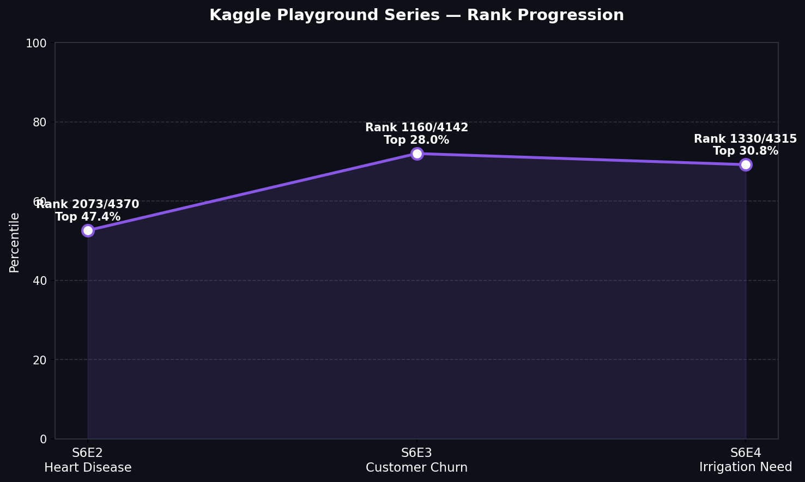

# Kaggle Playground Series

A personal repository tracking my participation in Kaggle's monthly Playground Series competitions.

---

### Competition Results

**Scores**
| Season | Episode | Topic | Metric | Public Score | Private Score |
|---|---|---|---|---|---|
| S6 | E2 | [Predicting Heart Disease](https://www.kaggle.com/competitions/playground-series-s6e2) | ROC AUC | 0.95334 | 0.95492 |
| S6 | E3 | [Predict Customer Churn](https://www.kaggle.com/competitions/playground-series-s6e3) | ROC AUC | 0.91420 | 0.91538 |
| S6 | E4 | [Predicting Irrigation Need](https://www.kaggle.com/competitions/playground-series-s6e4) | Balanced Accuracy | 0.97002 | 0.97039 |

**Standings**
| Season | Episode | Best Rank | Percentile | Best Model |
|---|---|---|---|---|
| S6 | E2 | 2073 / 4370 | Top 48% | LightGBM |
| S6 | E3 | 1160 / 4142 | Top 28% | Ensemble |
| S6 | E4 | 1330 / 4315 | Top 31% | XGBoost |

---

### Rank Progression

| Competition | Rank | Percentile |
|---|---|---|
| S6E2 - Heart Disease | 2073 / 4370 | Top 48% |
| S6E3 - Customer Churn | 1160 / 4142 | Top 28% |
| S6E4 - Irrigation Need | 1330 / 4315 | Top 31% |

---

### Tech Stack

| Category | Tools |
|---|---|
| **Languages** | Python |
| **ML / DL** | XGBoost, LightGBM, CatBoost, PyTorch, Scikit-learn |
| **Hyperparameter Tuning** | Optuna |
| **Data** | Pandas, NumPy |
| **Visualization** | Matplotlib, Seaborn, Plotly |
| **Hardware** | NVIDIA RTX 4060 Laptop GPU |

---

### Kaggle Profile
[Kaggle - Gaurav Singariya](https://www.kaggle.com/gauravsingariya)